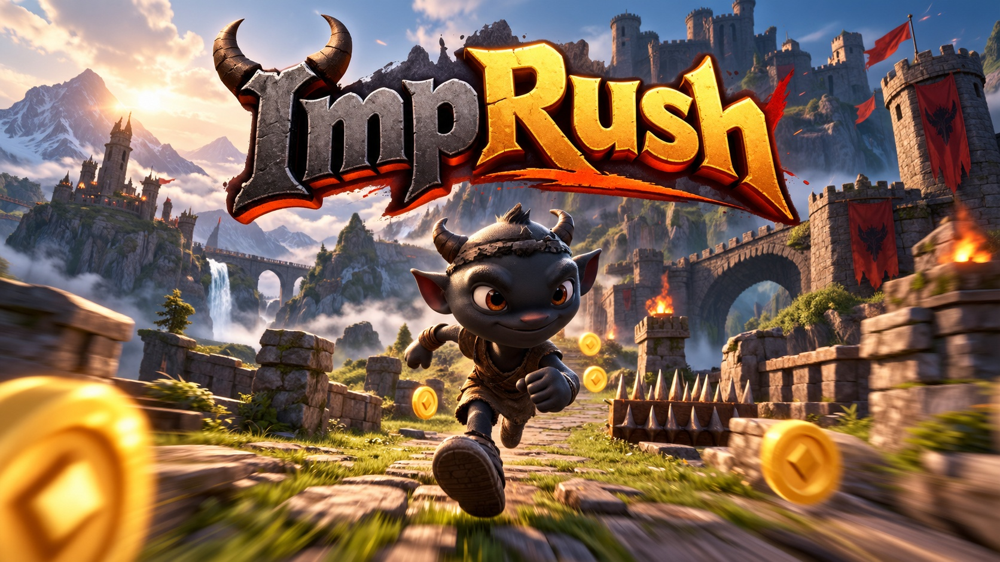
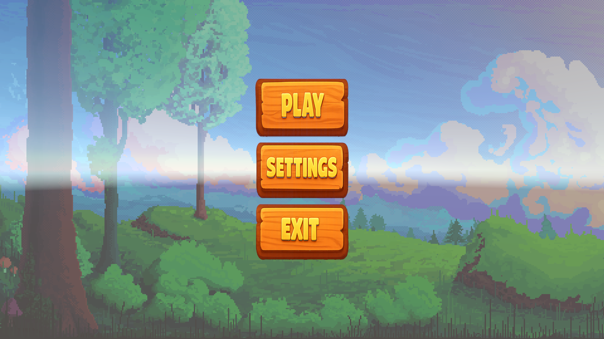
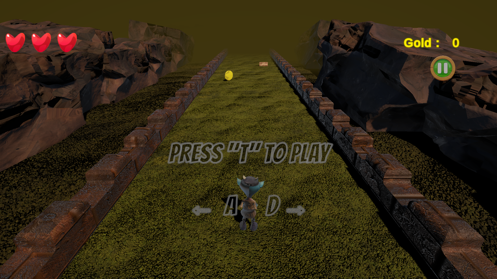
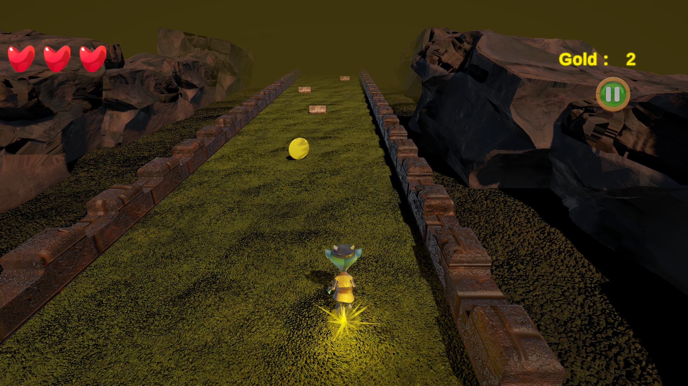
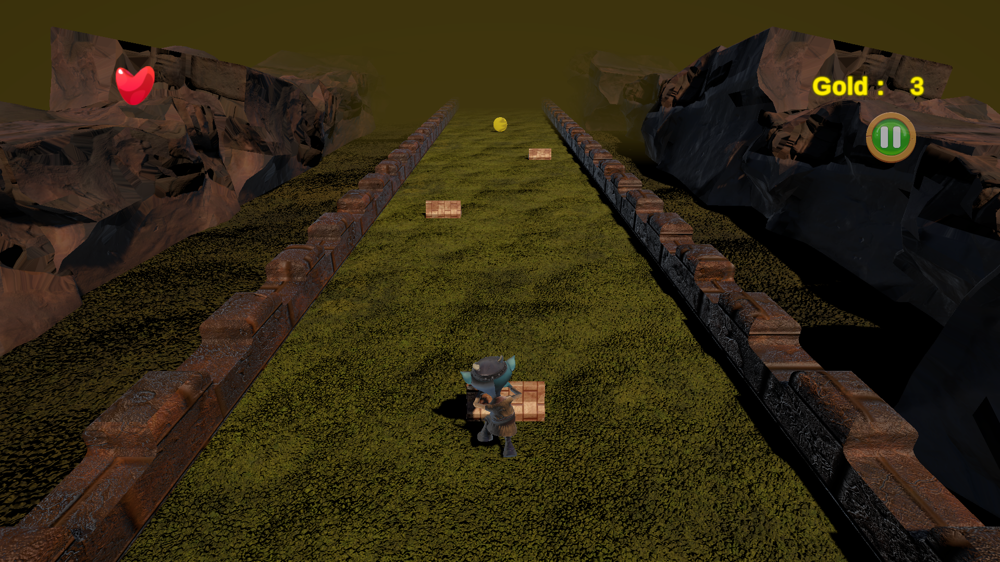

# 👹 ImpRush

<p align="center">
  
</p>

[](https://unity.com/)
[](https://play.unity.com)
[](LICENSE)

A fast-paced 3D endless runner game built with **Unity 6**. Guide Doozy, a little horned imp, down a rocky canyon path, collect as much gold as you can and dodge the wooden crates in your way!

🎮 **[Play the Game in Your Browser (Unity Play)](https://play.unity.com/en/games/7f9bdb25-ab84-4cb7-b652-642f7a8a6db2/imp-rush)**

---

## 📸 Screenshots

*In-game screenshots:*

| Main Menu | Gameplay | Gold Pickup | Obstacle |
| :---: | :---: | :---: | :---: |
|  |  |  |  |

---

## ✨ Features

- **State-Driven Character Mechanics:** Run, jump, knockback and death are controlled with Animator triggers and Rigidbody physics.
- **Dynamic Terrain Recycling:** Ground segments are moved ahead of the player and reused instead of being created endlessly.
- **Randomized Spawning:** Each ground piece randomly spawns gold, an obstacle or nothing, in a random lane.
- **Health System:** The imp has 3 lives. Hitting an obstacle causes knockback and costs one life; losing all of them triggers a death animation and restarts the level.
- **Collectibles:** Collect gold to raise your score, with a particle effect and sound on pickup.
- **Gradual Speed Increase:** Run speed slowly increases over time up to a maximum.
- **Pause Menu:** Resume, restart, return to the main menu or open settings, with animated panel transitions (DOTween).
- **Settings Panel:** Separate music and sound effect volume sliders using an Audio Mixer.
- **Audio System:** Menu and game music, footsteps, jump, gold, obstacle, death and button sounds handled through a central AudioManager.
- **WebGL Build:** Playable directly in the browser via Unity Play.

---

## 🕹️ Controls

| Action | Key / Input |
| ------ | ----------- |
| **Start the run** | `T` |
| **Move Left / Right** | `A` / `D` |
| **Jump** | `Spacebar` |

---

## 🧩 Scripts

| Script | Purpose |
| ------ | ------- |
| `MainCharacterController` | Movement, jumping, lane changes, health, knockback, death and speed increase |
| `InputManager` | Reads Input System actions and forwards them to the character |
| `GameManager` | Creates the initial ground pieces at the start of the level |
| `GroundSpawner` / `GroundPiece` | Ground recycling and random gold / obstacle placement |
| `Obstacle` | Detects collisions with the player |
| `Gold` | Rotating collectible, score update, particle effect and pickup sound |
| `UIManager` | Gold counter, health bar and start info text |
| `AudioManager` | Music and sound effects |
| `MainMenu` / `PauseMenu` | Menu navigation, pause, restart and settings |
| `VolumeSettings` | Music and SFX volume sliders |

---

## 🛠️ Tech Stack & Assets

- **Engine:** Unity 6.3 LTS (6000.3.13f1)
- **Language:** C#
- **Input System:** Unity Input System
- **Assets & Packages:**
  * Character & animations: [Mixamo](https://www.mixamo.com/) — Doozy
  * DOTween (HOTween v2)
  * Cartoon FX Remaster Free by Jean Moreno
  * Classic Footstep SFX
  * Animated Pixel-Art Backgrounds
  * Environment and UI assets: Unity Asset Store

---

## 📁 Project Structure

```
Assets/
└── Development/
    ├── Animations/
    ├── Input/
    ├── Materials/
    ├── Models/
    ├── PhysicMaterials/
    ├── Prefabs/
    ├── Scenes/      → S_MainMenu, S_GameScene
    ├── Scripts/     → includes a UI subfolder
    ├── Sounds/
    └── Textures/
```

---

## 🚀 Getting Started (Local Setup)

1. **Clone the repository:**
```
   git clone https://github.com/emirsumer/ImpRush.git
```
2. **Open with Unity:** Add the folder in Unity Hub and use Unity 6000.3.13f1 (or a compatible Unity 6 version).
3. **Run the Game:** Open `Assets/Development/Scenes/S_MainMenu.unity`, press **Play**, then press `T` to start running.

---

## 🙏 Credits

- Project structure and core runner logic follow my instructor's guidance.
- Character and animations from Mixamo; environment, UI, effects and sound assets from the Unity Asset Store.
- Cover art: AI-generated.

## 📜 License

This project is open-source and available under the
